# Amazon Q CLI Bridge - 実現可能性調査レポート

**作成日**: 2024年

**プロジェクト名**: q-cli-bridge

**目的**: Amazon Q CLIをVSCode拡張機能でラップし、サイドバーからDI/DXを向上させる

---

## 目次

1. [エグゼクティブサマリー](#1-エグゼクティブサマリー)
2. [Amazon Q CLIの概要](#2-amazon-q-cliの概要)
3. [技術的実現可能性](#3-技術的実現可能性)
4. [システムアーキテクチャ](#4-システムアーキテクチャ)
5. [類似プロジェクト事例](#5-類似プロジェクト事例)
6. [実装計画](#6-実装計画)
7. [リスクと課題](#7-リスクと課題)
8. [結論](#8-結論)

---

## 1. エグゼクティブサマリー

### 調査結果
✅ **プロジェクトは実現可能です**

### 主要な発見
- Amazon Q CLIは公式にサポートされており、安定した基盤がある
- VSCodeのWebView APIとNode.jsのchild_processを使用して統合可能
- 類似の成功事例（GitHub Copilot拡張など）が複数存在
- 技術的なブロッカーは存在しない

### 推奨事項
- WebView Viewを使用したサイドバー実装
- 非対話モード（`--no-interactive`）での統合
- 段階的な機能実装（MVP → フル機能）

---

## 2. Amazon Q CLIの概要

### 2.1 公式サポート状況

Amazon Q CLIは**AWS公式のコマンドラインツール**として提供されています。

**主要情報:**
- 公式リリース: 2025年3月にメジャーアップデート
- AIモデル: 複数のClaudeモデルをサポート（詳細は2.5節参照）
- 提供リージョン: AWS全リージョン
- ライセンス: AWS公式サポート
- 認証: Amazon Q CLI側で管理（拡張機能は認証情報を扱わない）

### 2.2 主要機能

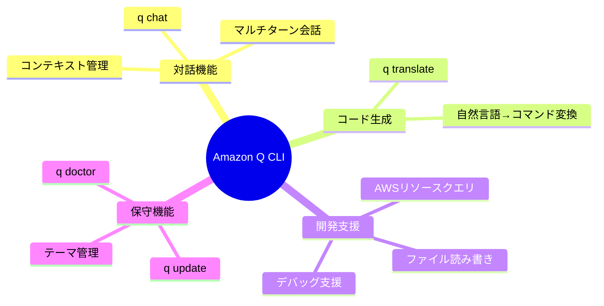

### 2.3 コマンドリファレンス

| コマンド | 機能 | 主要オプション |
|---------|------|---------------|
| `q chat` | 対話的チャットセッション | `--no-interactive`, `--resume`, `--trust-all-tools` |
| `q translate` | 自然言語→シェルコマンド変換 | `--n` (生成数) |
| `q doctor` | インストール診断・修正 | `--all`, `--strict` |
| `q update` | アプリケーション更新 | `--non-interactive` |
| `q theme` | テーマ管理 | - |

### 2.4 プログラム的使用方法

```bash
# 非対話モードでの使用（統合に最適）
q chat "ファイルを一覧表示するコマンドは？" --no-interactive

# セッション再開
q chat "続きを教えて" --resume

# コマンド生成
q translate "現在のディレクトリの全ファイルを表示"

# モデルを指定してチャット開始
q chat --model claude-4-sonnet "Pythonでファイルを読み込むコードを書いて"
```

### 2.5 利用可能なAIモデル

Amazon Q CLIは複数のAnthropicのClaudeモデルをサポートしており、タスクに応じて選択できます。

#### サポートされているモデル

| モデル名 | モデルID | 特徴 | 推奨用途 |
|---------|---------|------|----------|
| **Claude Sonnet 4** | `claude-4-sonnet` | 最新モデル、72.7%のagentic codingパフォーマンス | 複雑なコード分析、最適化タスク |
| **Claude 3.7 Sonnet** | `claude-3.7-sonnet` | デフォルトモデル、バランスの良いパフォーマンス | 一般的な開発タスク |
| **Claude 3.5 Sonnet** | `claude-3.5-sonnet` | 旧バージョン、安定性重視 | レガシーサポート |

**注意:** OpenAIモデル（GPTシリーズ）は現在Amazon Q CLIでは利用できません。Amazon Bedrockでは利用可能ですが、Q CLI経由のアクセスは未サポートです。

#### モデルの切り替え方法

```bash
# 方法1: チャット開始時にモデル指定
q chat --model claude-4-sonnet

# 方法2: セッション中にモデル切り替え
# チャット中に以下を入力
/model claude-4-sonnet

# 方法3: デフォルトモデルを設定
q settings chat.defaultModel claude-4-sonnet
```

#### モデル選択の優先順位

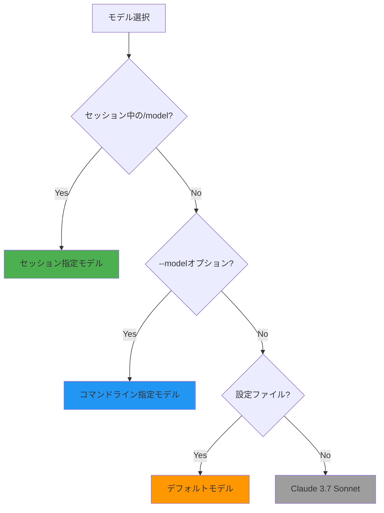

### 2.6 --no-interactiveモードの詳細

`--no-interactive`オプションは、VSCode拡張機能との統合において**最も重要な機能**です。

#### 対話モードと非対話モードの違い

| 特徴 | 対話モード（デフォルト） | 非対話モード（--no-interactive） |
|------|----------------------|--------------------------------|
| **実行形態** | 継続的なセッション | 単発のリクエスト/レスポンス |
| **入出力** | 双方向の対話 | 一方向の出力 |
| **プロセス** | 起動後も継続 | レスポンス後に終了 |
| **用途** | ターミナルでの直接使用 | プログラム的統合 |
| **ストリーミング** | リアルタイム表示 | 完全な出力を返す |

#### --no-interactiveの挙動

```bash
# 非対話モード: 単一の質問と回答
$ q chat "Pythonでファイルを読む方法" --no-interactive
# -> 回答を出力してプロセス終了

# 対話モード: 継続的な会話
$ q chat
> Pythonでファイルを読む方法
# -> 回答
> それをエラーハンドリングしたい
# -> 追加の回答（同じセッション内）
```

#### VSCode統合における利点

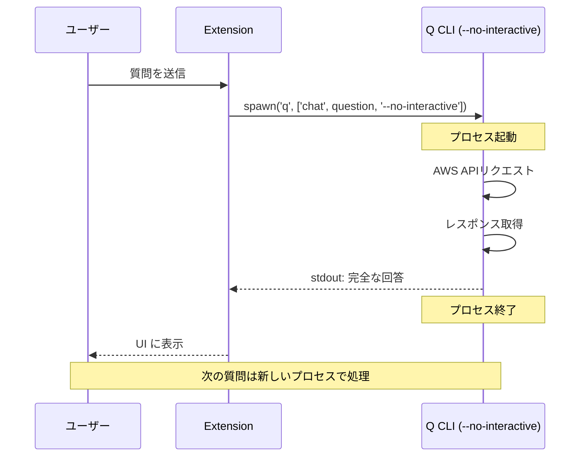

**利点:**
1. **プロセス管理が簡単**: 各質問ごとに独立したプロセス
2. **メモリリークの防止**: プロセスが毎回終了するため、メモリが解放される
3. **エラーリカバリー**: 1つの質問が失敗しても次に影響しない
4. **並列処理**: 複数の質問を同時に処理可能（必要な場合）

**注意点:**
- マルチターン会話には`--resume`オプションとの組み合わせが必要
- 各リクエストで新しいプロセスが起動するため、起動オーバーヘッドがある（通常1-2秒）

---

## 3. 技術的実現可能性

### 3.1 VSCode拡張機能の技術スタック

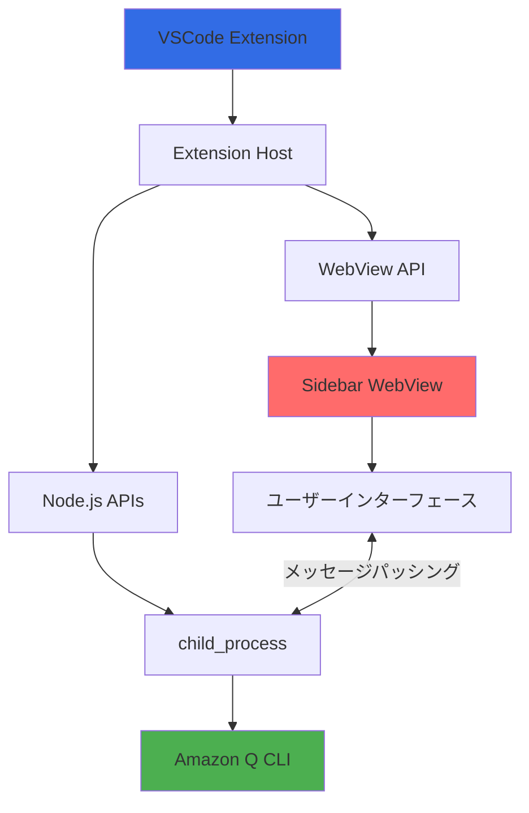

### 3.2 主要技術コンポーネント

#### 3.2.1 WebView API
VSCodeの公式API。カスタムUIをサイドバーに表示可能。

**特徴:**
- HTML/CSS/JavaScriptで自由にUI構築
- VSCode拡張機能本体とのメッセージパッシング
- セキュリティサンドボックス内で実行

**公式ドキュメント:**
- [Webview API Guide](https://code.visualstudio.com/api/extension-guides/webview)
- [Webview View Sample](https://github.com/microsoft/vscode-extension-samples/tree/main/webview-view-sample)

#### 3.2.2 メッセージパッシング（Message Passing）

メッセージパッシングは、**WebViewとVSCode拡張機能本体の間でデータをやり取りする仕組み**です。

##### 仕組みの概要

WebViewはセキュリティのため**サンドボックス内で実行**されます。そのため、直接的なメモリ共有や関数呼び出しができません。代わりに、`postMessage()`を使った**非同期メッセージ通信**を行います。

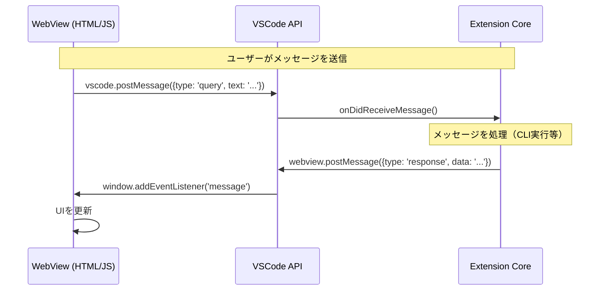

##### 実装例

**WebView側（HTML/JavaScript）:**
```javascript
// VSCode APIの取得
const vscode = acquireVsCodeApi();

// 拡張機能にメッセージを送信
function sendQuery(text) {
  vscode.postMessage({
    type: 'query',
    text: text
  });
}

// 拡張機能からのメッセージを受信
window.addEventListener('message', event => {
  const message = event.data;
  
  switch (message.type) {
    case 'response':
      displayResponse(message.content);
      break;
    case 'error':
      displayError(message.error);
      break;
  }
});
```

**Extension側（TypeScript）:**
```typescript
// WebView Providerクラス内
public resolveWebviewView(webviewView: vscode.WebviewView) {
  this._view = webviewView;
  
  // WebViewからのメッセージを受信
  webviewView.webview.onDidReceiveMessage(
    async (message) => {
      switch (message.type) {
        case 'query':
          const response = await this.executeQuery(message.text);
          // WebViewにレスポンスを送信
          webviewView.webview.postMessage({
            type: 'response',
            content: response
          });
          break;
      }
    }
  );
}
```

##### メッセージパッシングの特徴

**利点:**
- セキュリティが高い（サンドボックス分離）
- 柔軟なデータ構造（JSONシリアライズ可能なものなら何でも送信可能）
- 非同期処理に適している

**注意点:**
- 同期的なAPI呼び出しではない（Promise/async-awaitパターンが必要）
- 大きなデータの送信はパフォーマンスに影響
- メッセージの型安全性を確保するため、TypeScriptの型定義を活用すべき

##### 推奨パターン: リクエストID

複数のリクエストが並行する場合、各リクエストにIDを付与してレスポンスを紐付けます：

```javascript
// WebView側
let requestId = 0;
const pendingRequests = new Map();

function sendQuery(text) {
  const id = requestId++;
  
  return new Promise((resolve, reject) => {
    pendingRequests.set(id, { resolve, reject });
    
    vscode.postMessage({
      id: id,
      type: 'query',
      text: text
    });
  });
}

window.addEventListener('message', event => {
  const { id, type, content, error } = event.data;
  const pending = pendingRequests.get(id);
  
  if (pending) {
    if (type === 'response') {
      pending.resolve(content);
    } else if (type === 'error') {
      pending.reject(error);
    }
    pendingRequests.delete(id);
  }
});
```

#### 3.2.3 Node.js child_process
CLIプロセスをバックグラウンドで実行。

```javascript
import { spawn } from 'child_process';

const qProcess = spawn('q', ['chat', '--no-interactive', userInput]);

qProcess.stdout.on('data', (data) => {
  // 出力をWebViewに送信
  webviewView.webview.postMessage({ 
    type: 'response', 
    content: data.toString() 
  });
});
```

### 3.3 データフロー

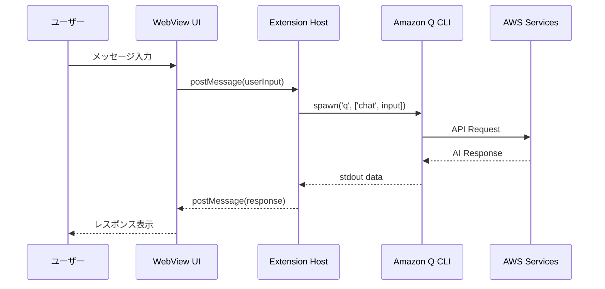

---

## 4. システムアーキテクチャ

### 4.1 全体アーキテクチャ

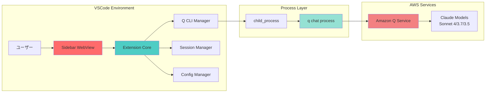

### 4.2 コンポーネント設計

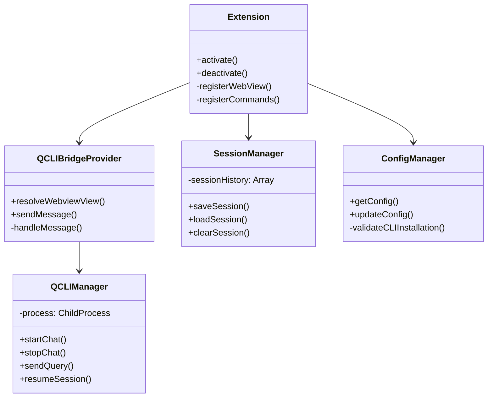

### 4.3 ディレクトリ構造（提案）

```
q-cli-bridge/
├── src/
│   ├── extension.ts                 # エントリーポイント
│   ├── providers/
│   │   └── QCLIBridgeProvider.ts   # WebView Provider
│   ├── managers/
│   │   ├── QCLIManager.ts          # CLI プロセス管理
│   │   ├── SessionManager.ts        # セッション管理
│   │   └── ConfigManager.ts         # 設定管理
│   ├── types/
│   │   └── index.ts                 # 型定義
│   └── webview/
│       ├── index.html               # WebView UI
│       ├── main.js                  # WebView ロジック
│       └── styles.css               # スタイル
├── resources/
│   └── icons/                       # アイコン
├── research-report/
│   └── feasibility-report.md        # 本レポート
└── package.json
```

---

## 5. 類似プロジェクト事例

### 5.1 GitHub Copilot Extension

**概要:**
- CLIではないが、AI統合の参考になる
- Chat Extensions APIを使用
- エディタとサイドバーの両方に統合

**学べるポイント:**
- AI応答のストリーミング表示
- コンテキスト管理
- マルチターン会話のUX

### 5.2 AWS Toolkit for VSCode

**概要:**
- AWSサービスのVSCode統合
- 認証管理の参考になる

**学べるポイント:**
- IAM Identity Center認証フロー
- AWS SDKとの統合方法
- 設定管理のベストプラクティス

### 5.3 Terminal統合拡張機能

多くの拡張機能がCLIツールをVSCodeに統合:
- Docker Extension
- Kubernetes Extension
- Azure CLI Extension

**共通パターン:**
- child_processでCLI実行
- 出力のパース＆整形
- コマンドパレットからのトリガー

---

## 6. 実装計画

### 6.1 フェーズ別実装

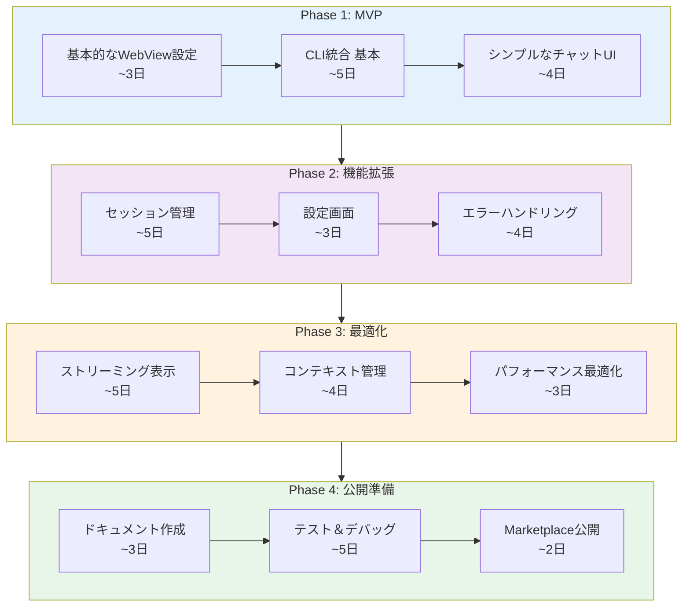

**想定工数:**
- **Phase 1 (MVP)**: 約2週間
- **Phase 2 (機能拡張)**: 約2週間
- **Phase 3 (最適化)**: 約2週間
- **Phase 4 (公開準備)**: 約2週間
- **合計**: 約2ヶ月

### 6.2 Phase 1: MVP（最小実行可能製品）

**目標:** 基本的なチャット機能の実装

**実装内容:**
1. WebView Providerの作成
2. `q chat --no-interactive`の統合
3. 簡単なメッセージ送受信UI
4. 基本的なエラー処理

**成功基準:**
- ユーザーがサイドバーから質問できる
- Amazon Qからの応答が表示される
- 基本的なエラーメッセージが表示される

### 6.3 Phase 2: 機能拡張

**実装内容:**
1. `--resume`を使ったセッション継続
2. 設定画面（CLIパス、オプション等）
3. 履歴表示機能
4. コピー＆ペースト機能

### 6.4 Phase 3: 最適化

**実装内容:**
1. ストリーミング表示（応答が段階的に表示）
2. ワークスペースコンテキストの自動送信
3. パフォーマンスチューニング
4. UIの洗練

### 6.5 Phase 4: 公開準備

**実装内容:**
1. README、CHANGELOG作成
2. 包括的なテスト
3. セキュリティレビュー
4. VSCode Marketplaceへの公開

---

## 7. リスクと課題

### 7.1 技術的課題

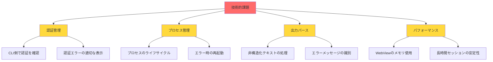

**重要な設計方針:**

本プロジェクトでは、**認証情報の管理はAmazon Q CLI側に完全に委譲**します。VSCode拡張機能は：
- 認証情報を保存しない
- 認証情報にアクセスしない
- 単にCLIを実行し、CLIが既に認証済みであることを前提とする

この方針により：
- セキュリティリスクを最小化
- 実装を簡素化
- Amazon Q CLIの認証機能をそのまま活用

### 7.2 リスク評価表

| リスク | 影響度 | 発生確率 | 対策 |
|-------|-------|---------|------|
| Amazon Q CLIの認証エラー | 高 | 中 | CLI認証状態の確認、明確なエラーメッセージとドキュメントへのリンク |
| CLIの出力形式変更 | 中 | 低 | バージョンチェック、柔軟なパーサー |
| プロセスのハング | 中 | 中 | タイムアウト設定、自動再起動 |
| WebViewのメモリリーク | 中 | 低 | 定期的なクリーンアップ |
| API利用料金 | 低 | 低 | 使用量の可視化、警告機能 |

### 7.3 制約事項

**必須条件:**
- Amazon Q CLIがインストール済み
- **Amazon Q CLIでAWS認証が完了している**（拡張機能は認証を行わない）
- インターネット接続が必要

**システム要件:**
- VSCode 1.104.0以上
- Node.js実行環境
- macOSまたはLinux（Amazon Q CLI対応OS）

**機能制限:**
- オフライン動作不可
- ストリーミング応答の遅延
- CLIの機能に依存（CLIでできないことは不可）

---

## 8. 結論

### 8.1 実現可能性の評価

| 評価項目 | スコア | コメント |
|---------|-------|---------|
| 技術的実現性 | ⭐⭐⭐⭐⭐ | 必要な技術はすべて利用可能 |
| 開発工数 | ⭐⭐⭐⭐ | MVP: 2-3週間、完全版: 2-3ヶ月 |
| メンテナンス性 | ⭐⭐⭐⭐ | Amazon Q CLIの安定性に依存 |
| ユーザー価値 | ⭐⭐⭐⭐⭐ | DX向上に大きく貢献 |
| 市場性 | ⭐⭐⭐⭐ | AWSユーザーには価値が高い |

### 8.2 最終結論

**✅ プロジェクトは実現可能であり、実装を推奨します**

**理由:**
1. **技術的基盤が整っている**: Amazon Q CLIは公式サポートされ、安定している
2. **実装パターンが確立**: VSCodeのWebView APIとchild_processの組み合わせは実績がある
3. **ユーザーニーズが明確**: AI支援ツールの需要は高く、VSCode統合は自然な流れ
4. **スコープが適切**: MVPから段階的に機能追加できる

### 8.3 次のステップ

**即座に開始できること:**
1. WebView Providerの基本実装
2. `q chat`コマンドの統合テスト
3. 簡単なUIのプロトタイプ作成

**推奨実装順序:**
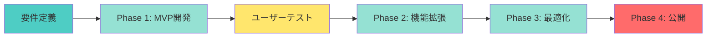

---

## 付録

### A. 参考リンク

**Amazon Q CLI公式ドキュメント:**
- [コマンドリファレンス](https://docs.aws.amazon.com/amazonq/latest/qdeveloper-ug/command-line-reference.html)
- [CLIの使用方法](https://docs.aws.amazon.com/amazonq/latest/qdeveloper-ug/command-line.html)

**VSCode拡張機能開発:**
- [WebView API](https://code.visualstudio.com/api/extension-guides/webview)
- [Extension Guidelines](https://code.visualstudio.com/api/references/extension-guidelines)
- [WebView View Sample](https://github.com/microsoft/vscode-extension-samples/tree/main/webview-view-sample)

**類似プロジェクト:**
- [GitHub Copilot Extension](https://code.visualstudio.com/docs/copilot/overview)
- [AWS Toolkit for VSCode](https://github.com/aws/aws-toolkit-vscode)

### B. 技術スタック詳細

| カテゴリ | 技術 | バージョン | 用途 |
|---------|------|-----------|------|
| ランタイム | Node.js | 22.x | 拡張機能実行環境 |
| 言語 | TypeScript | 5.9.2 | 開発言語 |
| フレームワーク | VSCode Extension API | 1.104.0+ | 拡張機能基盤 |
| ビルド | esbuild | 0.25.9 | バンドル |
| リンター | ESLint | 9.34.0 | コード品質 |
| CLI | Amazon Q CLI | latest | AIエンジン |

### C. 用語集

- **WebView**: VSCode内でHTML/CSS/JavaScriptを表示するためのUI要素
- **child_process**: Node.jsで外部プロセスを起動するためのモジュール
- **Extension Host**: VSCode拡張機能が実行されるプロセス環境
- **メッセージパッシング**: WebViewと拡張機能本体の間でpostMessage()を使ってデータをやり取りする非同期通信パターン
- **--no-interactive**: Amazon Q CLIの非対話モード。単発のリクエスト/レスポンスでプロセスが終了する
- **IAM Identity Center**: AWSの統合認証サービス（旧AWS SSO）
- **MVP**: Minimum Viable Product（最小実行可能製品）
- **Agentic Coding**: AIが自律的にコーディングタスクを実行する能力

---

**レポート作成者**: Droid (Factory AI Agent)
**レビュー状況**: Draft
**次回更新予定**: 実装開始後
